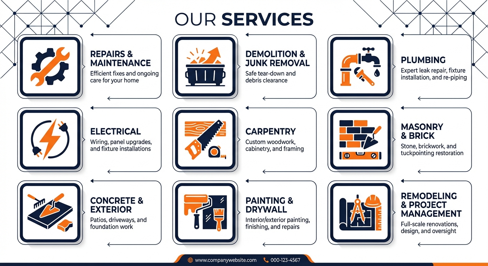
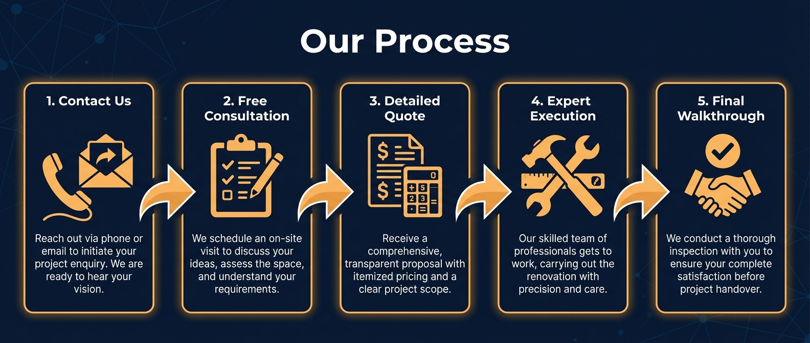
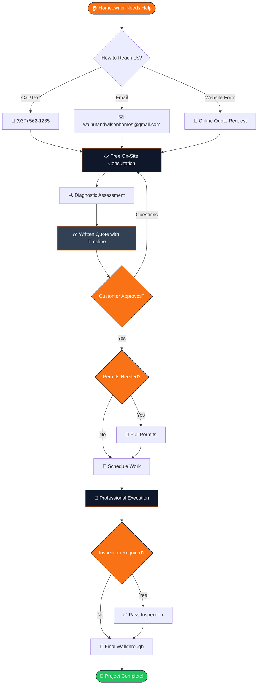
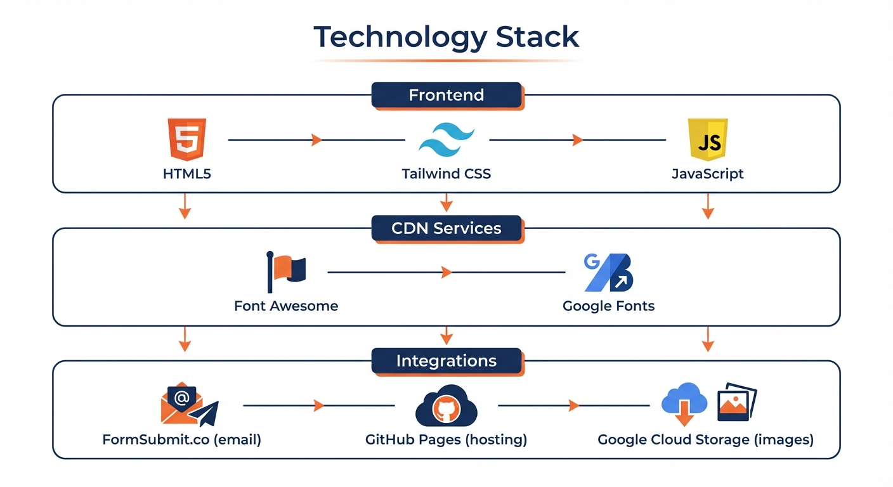
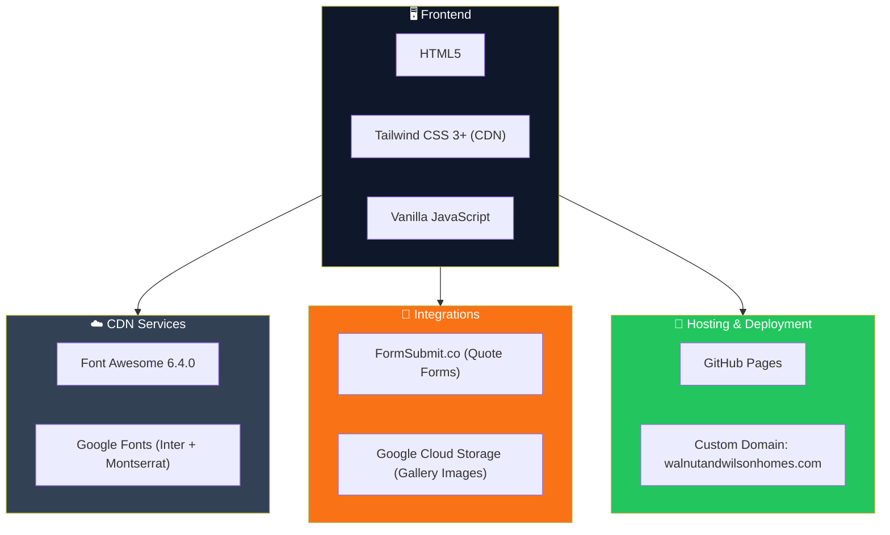
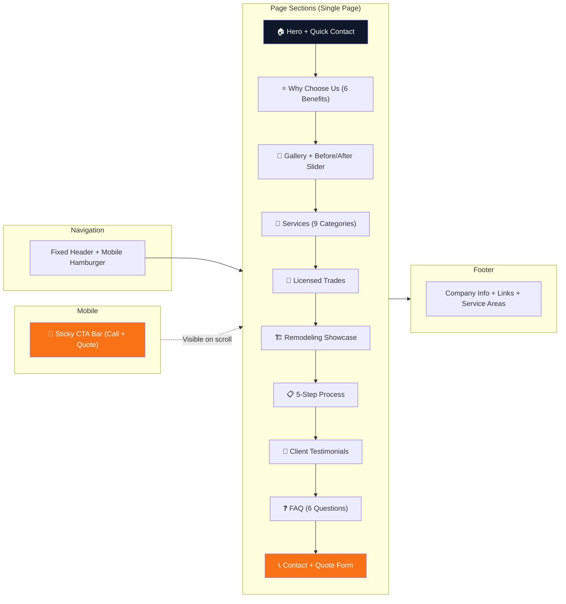
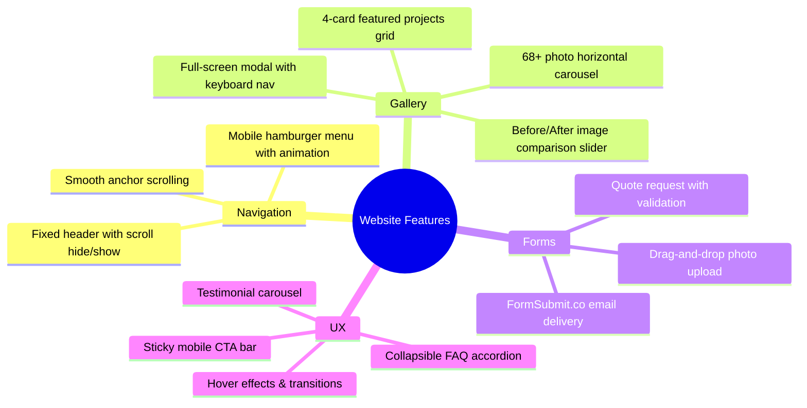
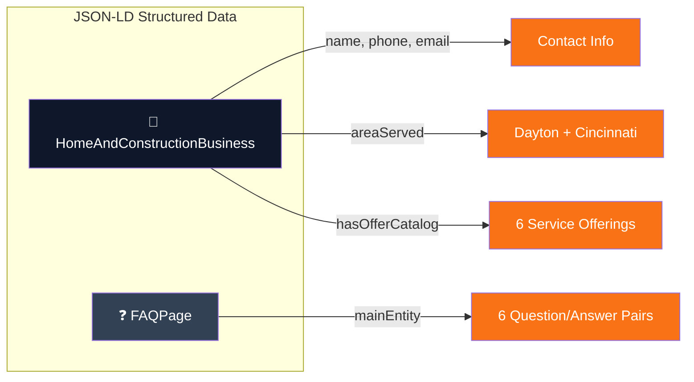
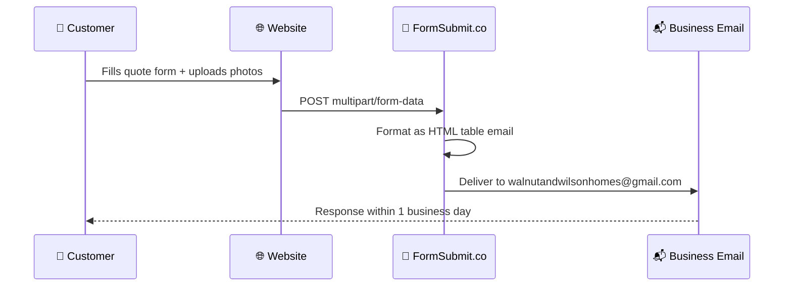

<div align="center">


# Walnut & Wilson Homes LLC

### Licensed Home Repairs & Renovations in Dayton & Cincinnati, OH

[](https://walnutandwilsonhomes.com)
[](https://github.com/flourishments/walnut-and-wilson-homes)
[](#tech-stack)
[](#tech-stack)
[](#tech-stack)

[](#license)
[](#)
[](#responsive-design)
[](#accessibility)
[](#seo)
[](#structured-data)

---

**From small fixes to full remodels — skilled work from a tight, experienced team.**

[View Live Site](https://walnutandwilsonhomes.com) &bull; [Request a Quote](https://walnutandwilsonhomes.com#contact) &bull; [Call (937) 562-1235](tel:9375621235)

</div>

---

## About

Walnut & Wilson Homes LLC is a licensed and insured home repair and renovation company serving the **Dayton** and **Cincinnati** metro areas in Ohio. With a lead manager bringing **20+ years** of residential and commercial experience, we handle everything from quick repairs to full-scale remodels — managed start-to-finish with a single point of contact.

This repository contains the production website deployed at [walnutandwilsonhomes.com](https://walnutandwilsonhomes.com).

---

## Services

<div align="center">

</div>

| Category | What We Do |
|----------|-----------|
| **Repairs & Maintenance** | Appliances, water heaters, punch lists, general repairs |
| **Demolition & Junk Removal** | Interior demo, furniture removal, cleanouts |
| **Plumbing** *(Licensed)* | Leak detection, drain cleaning, gas plumbing, water/sewer lines |
| **Electrical** *(Licensed)* | Diagnostics, wiring, panel upgrades, troubleshooting |
| **Carpentry & Finish Work** | Cabinetry, trim, moulding, framing |
| **Masonry / Brick / Stucco** | Chimney repair, brick walls, tuckpointing |
| **Concrete & Exterior** | Driveways, patios, decks, landscaping |
| **Painting & Drywall** | Interior/exterior painting, drywall repair, flooring |
| **Remodeling + Project Mgmt** | Bathrooms, kitchens, basements, whole-house renovations |

### Licensed Trades

```
┌─────────────────┐   ┌─────────────────┐   ┌─────────────────┐
│    PLUMBING      │   │   ELECTRICAL    │   │      GAS        │
│                  │   │                 │   │                 │
│  Water & sewer   │   │  Wiring, panel  │   │  Licensed gas   │
│  lines, gas      │   │  upgrades,      │   │  work for all   │
│  plumbing        │   │  diagnostics    │   │  residential    │
└─────────────────┘   └─────────────────┘   └─────────────────┘
```

---

## Customer Journey

<div align="center">

</div>


### Detailed Process Flow



---

## Tech Stack

<div align="center">

</div>



### Architecture Overview

| Layer | Technology | Purpose |
|-------|-----------|---------|
| **Markup** | HTML5 | Semantic structure with ARIA accessibility |
| **Styling** | Tailwind CSS 3+ (CDN) | Utility-first responsive design |
| **Typography** | Google Fonts | Inter (body) + Montserrat (headings) |
| **Icons** | Font Awesome 6.4.0 (CSS) | UI icons throughout the site |
| **Forms** | FormSubmit.co | Email-based quote request handling |
| **Images** | Google Cloud Storage | Gallery and project photo hosting |
| **Hosting** | GitHub Pages | Static site deployment with custom domain |
| **Domain** | walnutandwilsonhomes.com | CNAME-configured custom domain |

---

## Site Architecture



---

## Design System

### Color Palette

| Swatch | Name | Hex | Usage |
|--------|------|-----|-------|
|  | Navy Charcoal | `#0F172A` | Primary dark backgrounds, headings |
|  | Slate Medium | `#334155` | Body text, secondary sections |
|  | Off White | `#F8FAFC` | Light backgrounds |
|  | Warm Orange | `#F97316` | Accent, CTAs, interactive elements |
|  | Demo Gray | `#4B5563` | Supplementary text |

### Typography

| Role | Font Family | Weights |
|------|-------------|---------|
| **Headings** | Montserrat | 600, 700, 800 |
| **Body** | Inter | 300–800 |

### Responsive Breakpoints

```
Mobile First (default)  →  Tablet (768px / md:)  →  Desktop (1024px / lg:)
```

---

## Features

### Interactive Components



### Key Feature Details

| Feature | Description |
|---------|-----------|
| **Before/After Slider** | CSS + range input image comparison for 3 renovation projects |
| **Image Modal** | Full-screen gallery viewer with arrow key navigation and ESC close |
| **FAQ Accordion** | 6 collapsible questions, single-open behavior, FAQ schema markup |
| **Sticky Mobile CTA** | Fixed bottom bar with Call + Quote buttons, scroll-aware visibility |
| **Drag & Drop Upload** | Visual file upload with size formatting and file list preview |
| **Smart Header** | Hides on scroll down, reappears on scroll up (5px threshold) |

---

## SEO

### Optimization Summary

| Feature | Status |
|---------|--------|
| Descriptive `<title>` tag | ✅ |
| Meta description | ✅ |
| Canonical URL | ✅ |
| Open Graph tags | ✅ |
| Twitter Card tags | ✅ |
| Robots meta (index, follow) | ✅ |
| Semantic HTML5 structure | ✅ |
| Image alt text (descriptive) | ✅ |

### Structured Data

Two JSON-LD schemas are embedded:



---

## Accessibility

| Feature | Implementation |
|---------|---------------|
| **Skip to content** | Keyboard-accessible skip link (first element in body) |
| **Landmark roles** | `<header>`, `<main>`, `<footer>`, `<nav>` |
| **ARIA attributes** | Modal (`role="dialog"`), carousel buttons (`aria-label`), menu (`aria-expanded`) |
| **Image alt text** | Descriptive alt text on all 72+ images |
| **Form labels** | All inputs have matching `<label>` with `for`/`id` |
| **Keyboard navigation** | Arrow keys in modal, ESC to close, tab navigation |
| **Color contrast** | Orange accent on dark backgrounds meets WCAG AA |

---

## Performance

| Optimization | Details |
|-------------|---------|
| **Lazy loading** | 72 images with `loading="lazy"` + `decoding="async"` |
| **Hero priority** | `fetchpriority="high"` on LCP hero image |
| **Font Awesome** | CSS-only (JS bundle removed) |
| **DNS prefetch** | Pre-resolved `storage.googleapis.com` |
| **Resource hints** | `preconnect` for Google Fonts |

---

## Project Structure

```
walnut-and-wilson-homes/
├── index.html                  # Complete single-page website (2,071 lines)
│   ├── <head>                  # Meta tags, SEO, Open Graph, JSON-LD schemas
│   ├── <style>                 # Custom CSS (Tailwind extensions)
│   ├── <body>                  # All page sections
│   └── <script>                # Interactive JS components
├── CNAME                       # GitHub Pages domain → walnutandwilsonhomes.com
├── CLAUDE.md                   # AI assistant development guide
├── README.md                   # This file
├── images/
│   ├── logo.png                # Company logo
│   └── trim-work.jpg           # Featured project photo
├── website photos/             # 68 project photos (JPG, ~31 MB total)
│   ├── IMG-20260116-WA0001.jpg
│   ├── IMG-20260116-WA0002.jpg
│   └── ... (66 more)
└── docs/
    └── images/                 # README infographics
        ├── banner.jpg          # Company banner
        ├── customer-journey.jpg # Process flow infographic
        ├── services-overview.jpg # Services grid infographic
        └── tech-stack.jpg      # Architecture diagram
```

---

## Deployment


No build step required. Push to `main` triggers automatic GitHub Pages deployment.

### Local Development

```bash
# Clone the repository
gh repo clone flourishments/walnut-and-wilson-homes

# Open in browser (macOS)
open index.html

# Or serve locally
npx serve .
```

---

## Form Integration



**Form Fields:** Name, Phone, Email, City/Zip, Project Type (11 options), Description, Photo Upload (drag & drop), Preferred Timeline

---

## Service Area

```
                    ┌─────────────────────────────┐
                    │          OHIO                │
                    │                              │
                    │    ● Columbus                │
                    │                              │
                    │  ★ DAYTON ←── Full Service   │
                    │    (Main Area)               │
                    │         │                    │
                    │    ★ CINCINNATI ── Full Svc  │
                    │                              │
                    │  Surrounding areas on request │
                    └─────────────────────────────┘
```

---

## Contact

| Channel | Details |
|---------|---------|
| **Phone/Text** | [(937) 562-1235](tel:9375621235) |
| **Email** | [walnutandwilsonhomes@gmail.com](mailto:walnutandwilsonhomes@gmail.com) |
| **Website** | [walnutandwilsonhomes.com](https://walnutandwilsonhomes.com) |
| **Quote Form** | [Request a Quote](https://walnutandwilsonhomes.com#contact) |

---

## License

This project and all its contents are proprietary to **Walnut & Wilson Homes LLC**. All rights reserved.

---

<div align="center">

**Built with care by [Walnut & Wilson Homes LLC](https://walnutandwilsonhomes.com)**

*Licensed & Insured &bull; 20+ Years Experience &bull; Dayton & Cincinnati, OH*

[](https://walnutandwilsonhomes.com)

</div>
